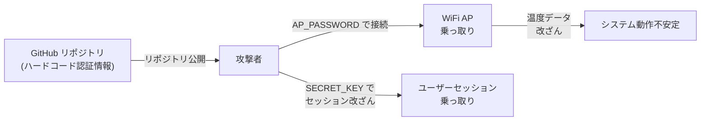

# セキュリティ改善提案書

**作成日:** 2025年12月27日  
**対象:** Raspberry Pi デュアルWiFi温度監視システム  
**優先度:** 🔴 高・🟡 中

---

## 目次

1. [セキュリティ問題の詳細](#セキュリティ問題の詳細)
2. [改善策](#改善策)
3. [実装手順](#実装手順)
4. [本番環境デプロイ前チェックリスト](#本番環境デプロイ前チェックリスト)

---

## セキュリティ問題の詳細

### 🔴 問題1: ハードコードされた認証情報

#### 現在の状態

**ファイル:** `temperature_server/config.py`

```python
class Config:
    AP_SSID = 'RaspberryPi_Temperature'
    AP_PASSWORD = 'RaspberryPi2025'           # ❌ ハードコード
    SECRET_KEY = 'dev-secret-key-change-in-production'  # ❌ デフォルト値
    TAILSCALE_AUTH_KEY = os.getenv('TAILSCALE_AUTH_KEY', '')  # ⚠️ 不完全
```

#### 問題点

| 項目 | リスク | 影響 |
|------|--------|------|
| **AP_PASSWORD** | ソースコード公開時に露出 | WiFi AP が容易に乗っ取られる |
| **SECRET_KEY** | デフォルト値では暗号化が機能しない | セッション偽造、CSRF攻撃に脆弱 |
| **TAILSCALE_AUTH_KEY** | 環境変数で設定するが、`.env` ファイルがGitに含まれる可能性 | 遠隔管理機能が乗っ取られる |

#### 悪用シナリオ



---

### 🔴 問題2: CORS 無制限設定

#### 現在の状態

**ファイル:** `temperature_server/app/__init__.py`

```python
from flask_cors import CORS

app = Flask(__name__)
CORS(app)  # ❌ ワイルドカード許可（全オリジンから接続可能）
```

#### 問題点

- **オリジン検証なし** → 任意のWebサイトから API が呼び出し可能
- **XSS 攻撃に対する保護がない** → 悪質なサイトから温度データを抽出される
- **CSRF 攻撃リスク** → 設定変更を強制される

#### 悪用シナリオ

```javascript
// 悪質なWebサイトから実行
fetch('http://raspberry-pi:5000/api/temperature', {method: 'POST', body: JSON.stringify({
  sensor_id: 'sensor_1',
  temperature: 99.9  // 異常な温度を送信
})})
```

---

### 🔴 問題3: 環境変数管理の不備

#### 現在の状態

**ファイル:** `free_wifi/config.py`, `temperature_server/config.py`

```python
# ❌ デフォルト値が設定されている
WEBDRIVER_PATH = os.getenv('WEBDRIVER_PATH', '/usr/bin/chromedriver')
TAILSCALE_AUTH_KEY = os.getenv('TAILSCALE_AUTH_KEY', '')
```

#### 問題点

- **`.env` ファイルが Git に含まれる可能性** → 秘密鍵がリポジトリ履歴に残る
- **複数環境での管理が煩雑** → 開発・本番で異なる設定が混在
- **環境変数の検証がない** → 必須項目が設定されていなくてもエラーにならない

---

### 🟡 問題4: ロギング情報の過度な出力

#### 現在の状態

**ファイル:** `temperature_server/app/routes/api.py`

```python
logger.info(f"Data inserted: sensor_id={sensor_id}, temp={temperature}, ..., rowid={cursor.lastrowid}")
```

#### 問題点

- **センサーID が本番ログに記録** → ログがS3等に保存される場合、ID が露出
- **詳細なデバッグ情報** → スタックトレース全体が出力される

---

### 🟡 問題5: SQLインジェクション対策の不十分さ

#### 現在の状態

**ファイル:** `temperature_server/database/queries.py`

```python
# ✓ パラメータ化クエリは使用
cursor.execute("SELECT * FROM temperatures WHERE sensor_id = ?", (sensor_id,))

# ただし...
sensor_id = data.get('device_id') or data.get('sensor_id')
if not sensor_id or not isinstance(sensor_id, str):
    return False, InvalidSensorIdError(sensor_id)
# ❌ sensor_id の長さ制限がない
```

#### 問題点

- **長文字列を使用したDoS攻撃** が可能
- **不正な形式（特殊文字）の拒否がない**

---

## 改善策

### ✅ 改善1: 環境変数による認証情報管理

#### ステップ 1: `.env` テンプレートを作成

**ファイル:** `.env.template`

```bash
# ===== セキュリティ設定 =====
# Flask シークレットキー（openssl rand -hex 32 で生成）
SECRET_KEY=your-secure-random-key-here

# ===== WiFi AP 設定 =====
# WiFi AP の SSID とパスワード
AP_SSID=RaspberryPi_Temperature
AP_PASSWORD=your-secure-ap-password-here

# ===== Tailscale 設定 =====
# Tailscale 認証キー（https://tailscale.com/admin/authkeys）
TAILSCALE_ENABLED=False
TAILSCALE_AUTH_KEY=tskey-...

# ===== ロギング設定 =====
LOG_LEVEL=INFO
FLASK_ENV=production
FLASK_DEBUG=False

# ===== 温度監視設定 =====
TEMPERATURE_MIN=5.0
TEMPERATURE_MAX=40.0
TEMPERATURE_ALERT_ENABLED=True

# ===== 許可するオリジン（CORS）=====
ALLOWED_ORIGINS=http://localhost:3000,http://192.168.4.1:5000
```

#### ステップ 2: 改善後のコード

**ファイル:** `temperature_server/config.py`（改善版）

```python
import os
from pathlib import Path
from dotenv import load_dotenv

# .env ファイルを読み込み
load_dotenv()

class Config:
    """アプリケーション設定クラス"""
    
    # ===== セキュリティ =====
    SECRET_KEY = os.getenv('SECRET_KEY')
    if not SECRET_KEY or SECRET_KEY == 'dev-secret-key-change-in-production':
        raise ValueError(
            "❌ SECRET_KEY is not configured properly!\n"
            "1. 環境変数 SECRET_KEY を設定してください\n"
            "2. openssl rand -hex 32 で生成してください\n"
            "3. .env ファイルに SECRET_KEY=... を追記\n"
        )
    
    # ===== WiFi 設定 =====
    AP_SSID = os.getenv('AP_SSID', 'RaspberryPi_Temperature')
    AP_PASSWORD = os.getenv('AP_PASSWORD')
    
    if not AP_PASSWORD:
        raise ValueError("❌ AP_PASSWORD must be set in .env file")
    
    if len(AP_PASSWORD) < 8:
        raise ValueError("❌ AP_PASSWORD must be at least 8 characters")
    
    # ===== CORS（許可するオリジン）=====
    ALLOWED_ORIGINS = os.getenv(
        'ALLOWED_ORIGINS',
        'http://localhost:3000,http://192.168.4.1:5000'
    ).split(',')
    
    # 以下は同じ...
    FLASK_ENV = os.getenv('FLASK_ENV', 'production')
    FLASK_DEBUG = os.getenv('FLASK_DEBUG', 'False').lower() == 'true'
    
    # Tailscale の検証
    TAILSCALE_ENABLED = os.getenv('TAILSCALE_ENABLED', 'False').lower() == 'true'
    if TAILSCALE_ENABLED:
        TAILSCALE_AUTH_KEY = os.getenv('TAILSCALE_AUTH_KEY')
        if not TAILSCALE_AUTH_KEY or not TAILSCALE_AUTH_KEY.startswith('tskey-'):
            raise ValueError("❌ Valid TAILSCALE_AUTH_KEY required when TAILSCALE_ENABLED=True")
```

---

### ✅ 改善2: CORS をホワイトリスト方式に変更

**ファイル:** `temperature_server/app/__init__.py`（改善版）

```python
from flask import Flask
from flask_cors import CORS
from config import Config
import logging

logger = logging.getLogger(__name__)

def create_app():
    """Flask アプリを作成"""
    
    app = Flask(__name__)
    app.config['ENV'] = Config.FLASK_ENV
    app.config['DEBUG'] = Config.FLASK_DEBUG
    app.config['SECRET_KEY'] = Config.SECRET_KEY
    
    # ===== CORS 設定（ホワイトリスト方式）=====
    cors_config = {
        "origins": Config.ALLOWED_ORIGINS,
        "methods": ["GET", "POST", "PUT", "DELETE"],
        "allow_headers": ["Content-Type", "Authorization"],
        "max_age": 3600
    }
    
    CORS(app, resources={
        "/api/*": cors_config,
        "/dashboard/*": cors_config
    })
    
    logger.info(f"CORS configured for origins: {Config.ALLOWED_ORIGINS}")
    
    # ブループリント登録...
    from app.routes.dashboard import dashboard_bp
    from app.routes.api import api_bp
    from app.routes.wifi import wifi_bp
    
    app.register_blueprint(dashboard_bp)
    app.register_blueprint(api_bp, url_prefix='/api')
    app.register_blueprint(wifi_bp)
    
    return app
```

---

### ✅ 改善3: セキュアなロギング設定

**ファイル:** `temperature_server/logger.py`（改善版）

```python
import logging
import logging.handlers
from pathlib import Path
from config import Config
import json

class SensitiveDataFilter(logging.Filter):
    """センシティブ情報をマスクするフィルター"""
    
    SENSITIVE_PATTERNS = [
        'password', 'token', 'key', 'auth',
        'sensor_id', 'device_id'
    ]
    
    def filter(self, record):
        """ログレコードをフィルタリング"""
        message = record.getMessage()
        
        # センシティブな単語をマスク
        for pattern in self.SENSITIVE_PATTERNS:
            if pattern.lower() in message.lower():
                # "password=XXX" → "password=***"
                import re
                message = re.sub(
                    f'{pattern}=([^,\\s]+)',
                    f'{pattern}=***',
                    message,
                    flags=re.IGNORECASE
                )
        
        record.msg = message
        return True

def setup_logger(name):
    """セキュアなロガーセットアップ"""
    logger = logging.getLogger(name)
    logger.setLevel(logging.INFO if Config.FLASK_ENV == 'production' else logging.DEBUG)
    
    # ファイルハンドラ
    log_file = Config.LOGS_DIR / f'{name}.log'
    log_file.parent.mkdir(parents=True, exist_ok=True)
    
    handler = logging.handlers.RotatingFileHandler(
        str(log_file),
        maxBytes=Config.LOG_MAX_BYTES,
        backupCount=Config.LOG_BACKUP_COUNT
    )
    
    # フォーマッタ
    if Config.FLASK_ENV == 'production':
        # 本番環境：最小限の情報
        formatter = logging.Formatter(
            '%(asctime)s - %(name)s - %(levelname)s - %(message)s',
            datefmt='%Y-%m-%d %H:%M:%S'
        )
    else:
        # 開発環境：詳細情報
        formatter = logging.Formatter(
            '%(asctime)s - %(name)s - %(levelname)s - %(filename)s:%(lineno)d - %(message)s'
        )
    
    handler.setFormatter(formatter)
    
    # センシティブデータフィルターを追加
    handler.addFilter(SensitiveDataFilter())
    
    logger.addHandler(handler)
    
    # コンソールハンドラ（開発環境のみ）
    if Config.FLASK_ENV == 'development':
        console = logging.StreamHandler()
        console.setFormatter(formatter)
        console.addFilter(SensitiveDataFilter())
        logger.addHandler(console)
    
    return logger
```

---

### ✅ 改善4: API バリデーションの強化

**ファイル:** `temperature_server/app/routes/api.py`（改善版）

```python
def validate_temperature_request(data):
    """温度データリクエストのバリデーション"""
    
    if not isinstance(data, dict):
        return False, InvalidJSONError("Request body must be JSON object")
    
    # センサーID取得
    sensor_id = data.get('device_id') or data.get('sensor_id')
    
    # ===== バリデーション強化 =====
    if not sensor_id or not isinstance(sensor_id, str):
        return False, InvalidSensorIdError(sensor_id)
    
    # 🆕 長さ制限（DoS 対策）
    MAX_SENSOR_ID_LENGTH = 50
    if len(sensor_id) > MAX_SENSOR_ID_LENGTH:
        return False, InvalidSensorIdError(
            f"sensor_id too long (max {MAX_SENSOR_ID_LENGTH} chars)"
        )
    
    # 🆕 形式チェック（英数字とアンダースコア のみ）
    import re
    if not re.match(r'^[a-zA-Z0-9_-]+$', sensor_id):
        return False, InvalidSensorIdError(
            "sensor_id must contain only alphanumeric, dash, and underscore"
        )
    
    # 温度取得・検証（既存のコード）
    temperature = data.get('temperature')
    if temperature is None:
        return False, InvalidTemperatureError()
    
    try:
        temperature = float(temperature)
    except (ValueError, TypeError):
        return False, InvalidTemperatureError(temperature)
    
    PHYSICAL_MIN = -50.0
    PHYSICAL_MAX = 150.0
    if not (PHYSICAL_MIN <= temperature <= PHYSICAL_MAX):
        return False, TemperatureOutOfRangeError(temperature, PHYSICAL_MIN, PHYSICAL_MAX)
    
    # オプションフィールド
    sensor_name = data.get('name') or data.get('sensor_name', 'Unknown')
    
    # 🆕 sensor_name の長さチェック
    MAX_SENSOR_NAME_LENGTH = 100
    if len(str(sensor_name)) > MAX_SENSOR_NAME_LENGTH:
        return False, InvalidJSONError(
            f"sensor_name too long (max {MAX_SENSOR_NAME_LENGTH} chars)"
        )
    
    humidity = data.get('humidity')
    
    return True, {
        'sensor_id': sensor_id,
        'temperature': temperature,
        'sensor_name': sensor_name,
        'humidity': humidity
    }
```

---

### ✅ 改善5: `.env` ファイルの Git 除外設定

**ファイル:** `.gitignore`（追加・確認）

```bash
# ===== 秘密鍵 =====
.env
.env.local
.env.*.local
.env.production.local

# ===== キャッシュ =====
__pycache__/
*.py[cod]
*$py.class
.pytest_cache/
.coverage

# ===== ログ・データ =====
logs/
*.log
temperature_server/data/
temperature_server/database/temperature.db

# ===== IDE =====
.vscode/
.idea/
*.swp
*.swo
```

---

## 実装手順

### 🔧 Phase 1: 環境構築（開発環境）

#### 1.1 `.env` ファイルを作成

```bash
cd f:\環境データ収集システム\raspberry_pi

# テンプレートをコピー
cp docs/.env.template .env

# エディタで編集
# .env ファイルを開いて、各項目を設定
```

#### 1.2 SECRET_KEY を生成

```powershell
# Windows PowerShell で実行
$bytes = @()
for ($i = 0; $i -lt 32; $i++) {
    $bytes += [byte](Get-Random -Minimum 0 -Maximum 256)
}
$hex = [System.BitConverter]::ToString($bytes) -replace '-', ''
Write-Host "SECRET_KEY=$hex"
```

> 生成されたキーを `.env` に追記：
> ```
> SECRET_KEY=ABC123DEF456...
> ```

#### 1.3 AP_PASSWORD を設定

```bash
# .env に追記（8文字以上推奨）
AP_PASSWORD=YourSecurePassword123!
```

---

### 🔧 Phase 2: コード修正（本番環境対応）

#### 2.1 `temperature_server/config.py` を更新

既存ファイルを改善版に置き換え（上記の改善3を参照）

#### 2.2 `temperature_server/app/__init__.py` を更新

CORS 設定をホワイトリスト方式に変更（上記の改善2を参照）

#### 2.3 `temperature_server/logger.py` を更新

センシティブデータフィルターを追加（上記の改善3を参照）

#### 2.4 `temperature_server/app/routes/api.py` を更新

バリデーション強化（上記の改善4を参照）

---

### 🔧 Phase 3: テスト

#### 3.1 環境変数の検証

```bash
cd temperature_server

# Python で設定を読み込み
python3 -c "from config import Config; print(f'✓ Config loaded: AP_SSID={Config.AP_SSID}')"
```

#### 3.2 CORS テスト

```bash
# API が正しいオリジンからのみ受け入れるか確認
curl -i -H "Origin: http://localhost:3000" http://localhost:5000/api/temperature
# ✓ Access-Control-Allow-Origin ヘッダーが返される

curl -i -H "Origin: http://evil.com" http://localhost:5000/api/temperature
# ❌ CORS ヘッダーが返されない
```

#### 3.3 バリデーションテスト

```bash
# 不正な sensor_id をテスト
curl -X POST http://localhost:5000/api/temperature \
  -H "Content-Type: application/json" \
  -d '{"sensor_id":"aaaaaa...aaa", "temperature":25.5}'
# ❌ エラーレスポンス（長さ制限）

curl -X POST http://localhost:5000/api/temperature \
  -H "Content-Type: application/json" \
  -d '{"sensor_id":"<script>alert(1)</script>", "temperature":25.5}'
# ❌ エラーレスポンス（形式不正）
```

---

## 本番環境デプロイ前チェックリスト

### 🔐 セキュリティチェック

- [ ] **SECRET_KEY が設定されている**
  ```bash
  grep "^SECRET_KEY=" .env | grep -v "dev-secret-key"
  ```

- [ ] **AP_PASSWORD が設定されている**
  ```bash
  grep "^AP_PASSWORD=" .env | wc -l  # 1 が返される
  ```

- [ ] **FLASK_DEBUG が False に設定されている**
  ```bash
  grep "^FLASK_DEBUG=False" .env
  ```

- [ ] **TAILSCALE_AUTH_KEY が安全に管理されている**
  ```bash
  # .env はこれ以上 Git に追加されていないか確認
  git status | grep ".env"  # .env が表示されなければ OK
  ```

- [ ] **.gitignore に .env が含まれている**
  ```bash
  grep "^\.env$" .gitignore
  ```

- [ ] **ロギングが本番モードに設定されている**
  ```bash
  grep "^FLASK_ENV=production" .env
  ```

- [ ] **CORS が適切に設定されている**
  ```bash
  grep "^ALLOWED_ORIGINS=" .env
  ```

### 📋 デプロイ前チェック

- [ ] `requirements.txt` が最新の依存関係を含んでいる
- [ ] ロギングが無効化（または最小化）されている
- [ ] SSL/TLS が設定されている（本番環境）
- [ ] ファイアウォールが適切に設定されている
- [ ] データベースバックアップが取得可能である
- [ ] ローテーションログの保持期間が定義されている

---

## 参考資料

### 🔗 関連ドキュメント

- [ENVIRONMENT_VARIABLES.md](ENVIRONMENT_VARIABLES.md) - 環境変数の詳細
- [ARCHITECTURE.md](ARCHITECTURE.md) - システムアーキテクチャ
- [TROUBLESHOOTING.md](TROUBLESHOOTING.md) - トラブルシューティング

### 📚 外部リンク

- [OWASP Top 10 2023](https://owasp.org/www-project-top-ten/)
- [Flask セキュリティ](https://flask.palletsprojects.com/en/latest/security/)
- [python-dotenv ドキュメント](https://python-dotenv.readthedocs.io/)

---

**最終更新:** 2025年12月27日  
**ステータス:** 改善提案 → 実装待ち
